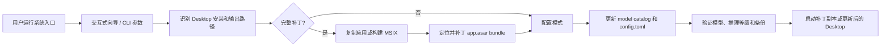

# Codex Desktop GPT-5.6 Patcher

<p align="center">
  
  
  
  
  
</p>

Codex Desktop GPT-5.6 Patcher 是一个面向 Codex Desktop / ChatGPT Desktop 用户的本地补丁工具。它可以让第三方 `Responses API` 中的 GPT-5.6 Sol、Terra、Luna 出现在 Desktop 模型下拉中，并显示 `low / medium / high / xhigh / max / ultra` 推理等级。

项目默认创建独立补丁副本，不直接覆盖普通官方安装；Windows Store / MSIX 版本会在向导中询问是否重打包替换原安装身份。工具不会下载第三方可执行文件，不读取、复制、输出或内嵌 API Key，也不会修改 ChatGPT Cookie、登录态或订阅权限。

默认第三方中转站为 `https://ai.heigh.vip/v1`。你可以在向导中改成自己的地址，也可以通过 `--base-url` 参数覆盖。

## 功能亮点

| 模块 | 能力 |
| --- | --- |
| 新手向导 | 双击系统入口即可交互式选择补丁模式、安装目录、输出目录和中转地址 |
| 安装识别 | 自动识别 Codex / ChatGPT Desktop，也支持手动传入应用目录、`.app`、AppImage、可执行文件或 `app.asar` |
| 独立副本 | 普通安装默认复制到用户目录，保留官方安装不动，失败时尽量回滚 |
| Store/MSIX | Windows Store 版本可选择同身份本机签名更新包，也可选择独立补丁分身 |
| 模型展示 | 移除 Desktop 前端对第三方模型的账号白名单展示过滤，只排除 `hidden=true` 的模型 |
| 推理等级 | 让 model catalog 声明的 `max` 和默认 `ultra` 可以进入推理强度菜单 |
| 上游配置 | 自动准备 `custom` provider、`Responses API` wire format 和默认 GPT-5.6 Sol |
| 多个分身 | 通过不同 `--output` 路径创建多个 Codex 应用入口，方便区分工作、个人或不同 provider |
| 无 Python fallback | 找不到 Python 时退回 Node.js 配置模式，至少更新 model catalog 和 `config.toml` |
| 中文路径兼容 | Windows 提权流程使用显式 UTF-8 invocation 文件，避免中文用户名路径被 PowerShell 5.1 误读 |

## 快速开始

### 环境要求

| 模式 | 环境要求 | 修改 Desktop 前端 | 更新模型目录 | 更新配置 | 适合场景 |
| --- | --- | --- | --- | --- | --- |
| 完整补丁模式 | Python 3.10+、Node.js 20+、npm/npx | 是 | 是 | 按需 | 需要解决模型显示为“自定义 / Custom” |
| 配置模式 | Node.js 20+ | 否 | 是 | 按需 | 没有 Python，只想先写入模型和 provider |

### 获取项目

```bash
git clone https://github.com/githubshansheng/codex-gpt-pacher.git
cd codex-gpt-pacher
```

已经配置 GitHub SSH Key 的用户也可以使用：

```bash
git clone git@github.com:githubshansheng/codex-gpt-pacher.git
```

不会使用 Git 的用户可以下载仓库压缩包，解压后运行对应系统入口。

### 一键运行

运行前请先完全退出 Codex Desktop / ChatGPT Desktop。

| 系统 | 入口 | 说明 |
| --- | --- | --- |
| Windows | 双击 `patch-windows.cmd` | 自动进入向导；Store/MSIX 场景会请求 UAC |
| macOS | 双击 `patch-macos.command` 或执行 `./patch-macos.command` | 下载包首次运行可能需要清除 quarantine |
| Linux | 执行 `./patch-linux.sh` | 支持目录安装和 AppImage 来源 |

macOS 下载包首次运行建议：

```bash
cd "/path/to/codex-gpt56-patcher"
xattr -dr com.apple.quarantine .
chmod +x patch-macos.command
./patch-macos.command
```

Linux 首次运行：

```bash
cd "/path/to/codex-gpt56-patcher"
chmod +x patch-linux.sh
./patch-linux.sh
```

## 上游配置

默认会准备 `custom` provider，并写入 `Responses API` 配置：

```toml
model_provider = "custom"
model = "gpt-5.6-sol"
review_model = "gpt-5.6-sol"
model_catalog_json = "C:/Users/your-name/.codex/model_catalog.json"

[model_providers.custom]
name = "custom"
base_url = "https://ai.heigh.vip/v1"
wire_api = "responses"
env_key = "CODEX_CUSTOM_API_KEY"
```

| 配置项 | 说明 |
| --- | --- |
| `base_url` | 默认 `https://ai.heigh.vip/v1`，可在向导中修改，也可用 `--base-url` 覆盖 |
| `env_key` | 默认 `CODEX_CUSTOM_API_KEY`，API Key 由用户自己放到环境变量中 |
| `wire_api` | 固定使用 `responses`，适配第三方 Responses API |
| `model_catalog_json` | 默认写入 `~/.codex/model_catalog.json`，已有自定义路径时会尽量复用 |
| `requires_openai_auth` | 对第三方 provider 按需设置为 `false`，支持不登录 ChatGPT 的 API Key 模式 |

Windows 用户级环境变量示例：

```powershell
[Environment]::SetEnvironmentVariable(
  "CODEX_CUSTOM_API_KEY",
  "你的 API Key",
  "User"
)
```

macOS / Linux 示例：

```bash
export CODEX_CUSTOM_API_KEY="你的 API Key"
```

环境变量变更后，需要完全退出并重新启动 Desktop。

## 模型与推理等级

| 层级 | 模型 ID | 显示名称 |
| --- | --- | --- |
| `sol` | `gpt-5.6-sol` | GPT-5.6 Sol |
| `terra` | `gpt-5.6-terra` | GPT-5.6 Terra |
| `luna` | `gpt-5.6-luna` | GPT-5.6 Luna |

默认推理等级：

```text
low / medium / high / xhigh / max / ultra
```

`max` 和 `ultra` 只表示本地 UI 允许选择，不代表第三方接口一定接受。若服务商不支持 `ultra`，请使用 `--disable-ultra` 隐藏它。

## 常用命令

| 命令 | 说明 |
| --- | --- |
| `python3 patch_codex_gpt56.py --guided` | 启动新手向导 |
| `python3 patch_codex_gpt56.py --dry-run --yes` | 只预览识别结果，不写文件 |
| `python3 patch_codex_gpt56.py --app "/path/to/Codex.app" --yes` | 指定官方来源应用 |
| `python3 patch_codex_gpt56.py --output "/path/to/Codex-Work.app" --yes` | 指定补丁输出目录 |
| `python3 patch_codex_gpt56.py --base-url "https://your-api.example/v1" --yes` | 指定第三方中转地址 |
| `python3 patch_codex_gpt56.py --catalog-only --yes` | 只更新 model catalog 和配置 |
| `python3 patch_codex_gpt56.py --desktop-only --yes` | 只修改 Desktop `app.asar` |
| `python3 patch_codex_gpt56.py --default-model keep --yes` | 保留当前默认模型 |
| `python3 patch_codex_gpt56.py --default-model sol --yes` | 默认使用 GPT-5.6 Sol |
| `python3 patch_codex_gpt56.py --tiers sol,terra --yes` | 只添加指定层级 |
| `python3 patch_codex_gpt56.py --disable-ultra --yes` | 隐藏 Ultra 推理等级 |
| `python3 patch_codex_gpt56.py --verify-only --app "/path/to/Codex.app"` | 验证已有补丁 |
| `python3 patch_codex_gpt56.py --self-test` | 运行 Python 自测 |
| `node configure_codex_gpt56.mjs --yes` | 无 Python 时运行配置助手 |
| `node configure_codex_gpt56.mjs --self-test` | 运行 Node.js 配置助手自测 |

## 多个 Codex 分身

普通安装默认输出到：

| 系统 | 默认补丁副本路径 |
| --- | --- |
| Windows | `%USERPROFILE%\Applications\Codex-GPT56-Patched` |
| macOS | `~/Applications/Codex-GPT56-Patched.app` |
| Linux | `~/.local/opt/codex-gpt56-patched` |

你可以重复运行并指定不同 `--output`，创建多个 Codex 应用入口：

```bash
python3 patch_codex_gpt56.py --output "$HOME/Applications/Codex-Work.app" --yes
python3 patch_codex_gpt56.py --output "$HOME/Applications/Codex-Personal.app" --yes
```

这意味着一台机器可以保留多个 Codex 分身。若要让不同分身使用不同账号或配置，通常还需要配合独立的 `CODEX_HOME`、系统用户、快捷方式环境变量或应用数据目录；本工具不会自动迁移 Cookie、登录态或密钥。

## Windows Store / MSIX

Windows Store 安装目录位于 `WindowsApps`，受 AppX 部署服务保护，不建议直接修改 ACL 或手动覆盖 `app.asar`。

双击 `patch-windows.cmd` 且未传入 `--output` 时，向导会让你选择：

| 选择 | 行为 | 适合场景 |
| --- | --- | --- |
| 替换原安装身份 | 从当前 Store 包生成本机签名 MSIX 更新包，保留 `OpenAI.Codex_2p2nqsd0c76g0!App` 启动身份 | 希望开始菜单和任务栏固定项继续指向同一个应用 |
| 不替换 | 创建独立补丁分身，并显示新的安装路径 | 希望保留官方 Store 应用不动 |

同身份更新包和部署记录通常位于：

```text
<磁盘>:\CodexGPT56Patcher\packages
%USERPROFILE%\.codex\backups\codex-gpt56\store-packages
```

## 回滚与更新

| 场景 | 回滚方式 |
| --- | --- |
| 配置写错 | 用 `~/.codex/config.toml.backup-YYYYMMDD-HHMMSS` 覆盖当前 `config.toml` |
| 模型目录写错 | 用 `model_catalog.json.backup-YYYYMMDD-HHMMSS` 覆盖当前 catalog |
| 普通补丁副本 | 用 `resources/app.asar.original` 覆盖补丁副本中的 `resources/app.asar` |
| macOS 副本恢复后 | 重新执行 `codesign --force --deep --sign - <补丁副本.app>` 和 `xattr -cr <补丁副本.app>` |
| Windows Store/MSIX | 使用 Windows“设置 -> 应用 -> Codex -> 高级选项 -> 修复/重置”，或从 Microsoft Store 重新安装 |
| AppImage 来源 | 删除补丁目录 `~/.local/opt/codex-gpt56-patched` 或你指定的 `--output` 目录后重新生成 |

Desktop 自动更新、Store 修复或重置后，补丁可能被官方文件覆盖。遇到模型菜单恢复原状时，基于新版 Desktop 重新运行补丁即可。

## 项目结构

```text
codex-gpt-pacher/
├─ patch_codex_gpt56.py          # 完整补丁主程序
├─ configure_codex_gpt56.mjs     # Node.js 配置模式助手
├─ patch-windows.cmd             # Windows 一键入口
├─ patch-windows.ps1             # Windows 入口与 Store/MSIX 分流
├─ patch-windows-store.ps1       # Windows Store/MSIX 重打包和部署流程
├─ patch-macos.command           # macOS 一键入口
├─ patch-linux.sh                # Linux 一键入口
├─ patch-unix.sh                 # Unix 通用入口
├─ test_patcher.py               # Python 单元测试
└─ RUN-ON-MACOS.txt              # macOS 运行提示
```

## 补丁流程



完整补丁会修改 Desktop 前端模型展示逻辑，让 model catalog 中 `hidden=false` 的第三方模型可以显示，并让有效推理等级不再被账号动态配置截断。该修改只影响本地展示和配置，不会绕过第三方服务端权限。

## 常见问题

| 问题 | 处理 |
| --- | --- |
| 运行后仍显示“自定义 / Custom” | 确认运行的是完整补丁模式，Desktop 已完全退出，并且启动的是补丁副本或已更新的 Store 应用 |
| 下拉出现模型但请求报 `Model not found` | 第三方服务商没有开放对应模型；用 `--tiers sol,terra` 只添加真实可用模型 |
| Max 或 Ultra 请求失败 | `max` / `ultra` 是否可用由第三方接口决定；不支持 Ultra 时用 `--disable-ultra` |
| macOS 提示应用已损坏或无法验证 | 对补丁目录执行 `xattr -dr com.apple.quarantine .`，对补丁副本执行本地签名 |
| Windows 无法读取 WindowsApps | 用 `Get-AppxPackage OpenAI.Codex | Select-Object InstallLocation` 获取路径，再通过 `--app` 传入 `InstallLocation\app` |
| 中文用户名路径下 JSON 报错 | 使用新版脚本；提权 invocation 文件已显式 UTF-8 读写，通常不需要移动到英文路径 |
| Linux 找不到安装位置 | 用 `./patch-linux.sh --app ~/Downloads/Codex.AppImage` 或传入应用目录 / `app.asar` |
| 不登录 ChatGPT 账号能用吗 | 可以走第三方 provider 的 API Key 模式；工具不会生成 API Key，也不会修改登录态 |

## 安全与隐私

- 非 OpenAI 官方补丁，使用前请自行评估本地应用签名变化。
- 普通安装默认创建补丁副本，不修改官方安装目录。
- Windows Store / MSIX 只有在你选择替换时，才会安装本机签名的同身份更新包。
- 不读取、显示、复制、迁移或上传 API Key。
- 不修改 ChatGPT Cookie、登录态、订阅权限或服务端权限。
- 不修改 `codex.exe` / `codex` 命令行程序本体。
- 不保证第三方服务商开放 catalog 中的全部模型。
- 不保证 `max` / `ultra` 被第三方接口接受。
- 配置模式不能绕过 Desktop 前端账号白名单。
- 提交代码前建议运行 `rg -n "sk-|api[_-]?key|secret|token|password|BEGIN .*PRIVATE KEY" . -S` 进行敏感信息复查。

## 开发约定

1. 修改 CLI 参数时，同时更新 Python、Node.js fallback 和 README 常用命令表。
2. 修改 Windows Store/MSIX 流程时，同时验证 `patch-windows.ps1` 与 `patch-windows-store.ps1` 的 PowerShell AST。
3. 修改 model catalog 字段时，同时检查 `patch_codex_gpt56.py`、`configure_codex_gpt56.mjs` 和 `test_patcher.py`。
4. 涉及中文路径、空格路径或提权流程时，在 Windows PowerShell 5.1 下复测。
5. 提交前至少运行下面的验证命令。

```bash
python -m unittest -v
python patch_codex_gpt56.py --self-test
python -m py_compile patch_codex_gpt56.py test_patcher.py
node --check configure_codex_gpt56.mjs
node configure_codex_gpt56.mjs --self-test
```

PowerShell 脚本语法检查：

```powershell
[System.Management.Automation.Language.Parser]::ParseFile(
  "patch-windows.ps1",
  [ref]$null,
  [ref]$null
) | Out-Null
```

## 开源状态

当前仓库尚未添加独立 `LICENSE` 文件。正式公开或二次分发前，请根据分发目标补充许可证，并确认本地补丁、重打包、签名和第三方服务调用方式符合对应条款。
